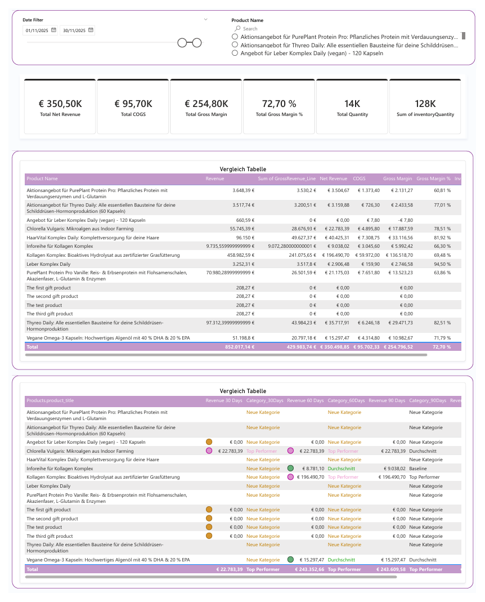

# New Product Performance Analytics Dashboard

## 📊 Business Problem

When new products are launched, business teams need to monitor their performance quickly to evaluate market acceptance, profitability, and inventory efficiency.

This project tracks newly launched product performance using automated data integration and Power BI analytics.

---

## 📂 Data Sources

Data was extracted via API integrations including:

- Product data
- Order data
- Inventory data

Data was merged and transformed inside Power BI using Power Query.

---

## 🛠 Tools & Technologies

- Power BI
- Power Query
- DAX
- REST API Integration
- Data Modeling

---

## ⚙ Data Transformation

- API data retrieval
- Merging product and order datasets
- Cleaning and transformation using Power Query
- Creation of calculated columns and relationships

---

## 📈 KPIs Developed

- Total Net Revenue
- Cost of Goods Sold
- Gross Margin
- Gross Margin %
- Quantity Sold
- Inventory Quantity
- 30 / 60 / 90 Day Product Performance

---

## 📊 Dashboard Features

✔ Monitoring performance of new products  
✔ Profitability analysis  
✔ Inventory monitoring  
✔ Product filtering  
✔ Time-based performance comparison  

---

## 📷 Dashboard Preview

---

## ⚠ Data Privacy

All data shown in this project is anonymized.
